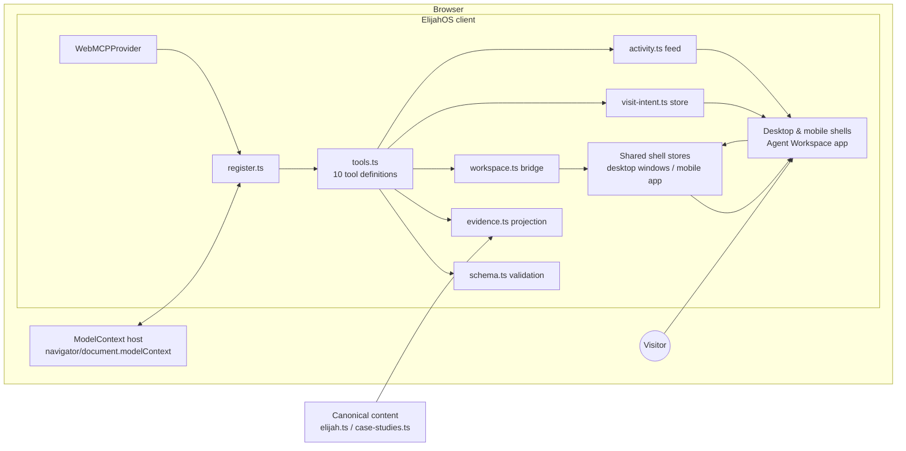

# ElijahOS WebMCP architecture

> Architecture record for the WebMCP Challenge release.
>
> This document explains how the shipped system is put together and why its key decisions were made. The [PRD](./webmcp-prd.md) owns product intent, the [tool reference](./webmcp-tools.md) owns exact contracts, and the [README](../README.md) owns the thesis. Where prose and code disagree, the code and its tests are the truth.

## System overview

ElijahOS is one Next.js application with two human shells — a windowed desktop OS and a one-app-at-a-time mobile shell — and a client-side WebMCP layer that registers ten typed tools against a browser ModelContext host. There is no agent server: the WebMCP path runs entirely in the visitor's browser, over the same stores the human interface uses.

Both participants converge on the same state: agent tool calls mutate the real shell stores, human actions mutate the same stores, and `get_workspace_state` reads a bounded snapshot back out.

## Module map

| Module | Responsibility |
| --- | --- |
| `src/components/WebMCPProvider.tsx` | Mounts with the shell, probes for a ModelContext host, re-probes a bounded number of times for late-injecting hosts, and registers exactly once |
| `src/lib/webmcp/model-context.ts` | Host detection against `navigator.modelContext` or `document.modelContext`, using a minimal structural type rather than a vendor SDK |
| `src/lib/webmcp/register.ts` | Idempotent registration and the `executeTool` wrapper: validate input, run the handler, convert thrown errors into structured failures, record activity |
| `src/lib/webmcp/tools.ts` | The ten tool definitions — names, titles, descriptions, input schemas, read-only/untrusted annotations, and handlers |
| `src/lib/webmcp/schema.ts` | A deliberately narrow JSON-schema subset and `validateInput` |
| `src/lib/webmcp/visit-intent.ts` | The bounded visitor brief: hard caps on objective, context label, priorities, and evidence standard; normalization; a session-scoped store the person can edit or clear |
| `src/lib/webmcp/workspace.ts` | `composeWorkspace` (one to three records, id deduplication, compare/focus/grid layouts) and `workspaceSnapshot` (the bounded shared-state readback) |
| `src/lib/webmcp/activity.ts` | The in-memory tool activity store rendered as the on-page audit feed |
| `src/lib/webmcp/intent-presets.ts`, `eval-fixtures.ts` | Intent presets and fixture prompts used by tests and evaluation |
| `src/lib/evidence.ts` | The derived evidence projection: typed records built from the canonical content, token search with explicit unmatched terms, and the public disclosure list |
| `src/lib/apps.ts`, `app-launcher.ts`, `desktop-store.ts` | Pre-existing app registry, shell-neutral launcher, and desktop window state that both humans and tools go through |
| `src/components/apps/AgentWorkspaceApp.tsx` | Displays the visit brief (editable), the activity feed, and the agent-facing state of the session |

## Anatomy of a tool call

1. The host invokes a registered tool with agent-supplied input.
2. `executeTool` validates the input against the tool's narrow schema; invalid input returns a structured failure, never a throw.
3. The handler reads from the evidence projection or content stores, or performs an allowlisted shell action through the same launcher and stores the human UI uses.
4. The result is a typed object — including typed "not found" and unmatched-term outcomes — and the invocation is appended to the visible activity feed.

Read-only tools (six) touch no store. Action tools (four) produce only visible, reversible UI state.

## Key decisions

**D1 — Client-only adapter, no agent server.**
The WebMCP path has no server route, model call, provider credential, database, analytics, or persistent log. *Why:* the visitor's agent already has a model; the site's job is bounded domain truth and visible action, and the strongest privacy statement is an architecture that cannot retain anything. *Trade-off accepted:* no server-side telemetry about agent behavior — the on-page activity feed is the observability surface, and it belongs to the visitor.

**D2 — Evidence is a derived projection, not a second biography.**
`evidence.ts` builds records from the same canonical sources that render the human pages. *Why:* two sources of truth would drift, and drift in a provenance-focused project is fatal. *Trade-off accepted:* the projection can only expose what the canonical content documents; gaps surface as explicit unmatched terms and limitations rather than being filled in.

**D3 — A narrow hand-rolled schema subset instead of a validation library.**
*Why:* tool inputs are small and flat; a full JSON-schema dependency adds bundle weight and a larger attack/ambiguity surface than the inputs justify. *Trade-off accepted:* fewer schema features, which is enforced as a design constraint on tool inputs rather than worked around.

**D4 — Tools reuse the human shell instead of a parallel agent UI.**
`compose_workspace` and `open_app` go through the existing registry, launcher, window store, and mobile opener. *Why:* agent actions must be real, visible, and correctable by hand — the human continuation only works if both participants operate the same machinery. *Trade-off accepted:* tools can only do what the shell allows; the allowlist is the feature, not a limitation.

**D5 — Session-scoped, hard-capped visit intent.**
The brief has strict length and count caps and lives in a session-scoped store rendered on the page. *Why:* the agent should distill an objective, not transfer the visitor's private context; visibility and editability keep the person in charge of what the site knows. *Trade-off accepted:* no cross-visit memory, by design.

**D6 — Structural host typing with bounded re-probing.**
The adapter types the host structurally (`ModelContextLike`) and `WebMCPProvider` re-probes after mount for hosts that inject late, registering idempotently. *Why:* host implementations and injection timing vary across browsers; coupling to one vendor shape would break others. *Trade-off accepted:* the adapter validates behavior at the boundary instead of trusting a typed SDK.

**D7 — Injected-host tests are kept separate from native claims.**
Playwright drives the real dispatcher through an injected ModelContext host; native discovery and execution in a supported browser are verified and recorded separately. *Why:* a fake host proves the dispatcher, not the deployment — conflating the two would overstate the evidence, which this project treats as a defect. *Trade-off accepted:* two verification tracks to maintain instead of one.

## Testing architecture

- **Unit tests**, colocated in `src/lib/webmcp/*.test.ts`, cover schemas, validation, tool outputs, annotations, intent normalization, and workspace side effects.
- **Browser integration** (`npm run test:webmcp`) exercises registration and every tool through an injected host in Playwright, including the human-action → `get_workspace_state` handoff.
- **Responsive suite** (`npm run test:responsive`) proves both shells work with no ModelContext host present.
- **Release gates** (`npm run verify`) add lint, types, UI contracts, the public content index, and the public export manifest; native deployed-browser checks are recorded in the [submission control ledger](./webmcp-submission-control.md).

## Trust boundaries

- Everything arriving from the host — tool inputs, pasted objectives — is untrusted data and is validated, capped, and displayed rather than executed or persisted.
- Tool annotations accurately declare read-only behavior and untrusted-content handling so hosts can apply their own policies.
- No tool contacts anyone, authenticates, purchases, submits, scores, or ranks; UI mutations are allowlisted and reversible.
- The optional Ask Elijah Lite guide is a separate server route with its own boundary and is not part of the WebMCP surface.
